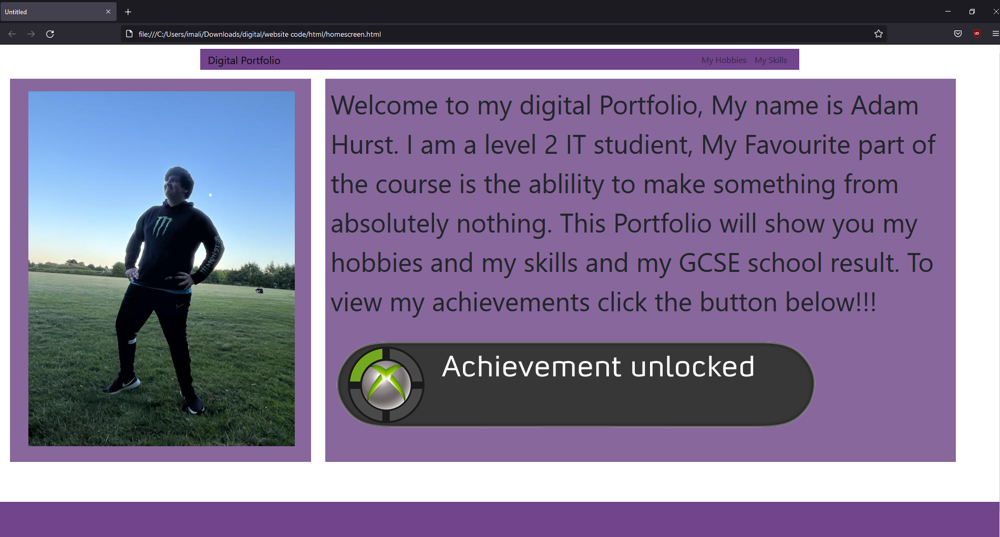

# Digital Portfolio

+ My portfolio is aimed at IT companys mainly the coding and software indestry, the point of my porfolio is to wow the employer just like a CV would. It would show off my skills and attributes, as well as having a place where i can show off my privous coding skills

# What They Will Need

## The necessary content
+ My GCSE results and any other qualifications
+ My achievements 
+ My skills 
+ My experience

They will need my qualifications and education as they need to know if I am qualified for the job they want me to do.

They need to be able to see my achievements to be able to see what i've achieved in my coding history to see if im suitible for the job they want me to do.

They want to see my skills to be able to see if my skills meet there requirements. 

They will want to see my experience to be able to see how well i can do the job their hiring me for.

The portfolio needs to have a smooth and fast rendering times under 2 seconds.

# Story Board

Home page:

Hobbies list

Hobbies Page:

# Asset list

| Asset           | Origin                                                   |
|-----------------|----------------------------------------------------------|
| Valorant Video  | https://www.youtube.com/channel/UCdr-ie8hyOWVx1t8T5o_OoA |
| Valorant logo   | https://plati.market/itm/3032606&ai=69858?lang=en-US     |
| CSGO Video      | https://www.youtube.com/watch?v=6cGhaUntByk              |
| CSGO logo       | https://1000logos.net/csgo-logo/                         |
| Youtube Video   | https://www.youtube.com/watch?v=uAM0m-VNJ8E              |
| Youtube logo    | https://www.freepnglogos.com/pics/youtube-logo-png       |
| Home Page image | My Image                                                 |
| Hobbies Image   | My Image                                                 |
|                 |  

# Navigation map

| Column - FROM Row - TO | HOME | HOBBIES | SKILLS | ACHIEVEMENTS | VALORANT | CSGO | UNIT 13 | GCSE | YOUTUBE |
|------------------------|------|---------|--------|--------------|----------|------|---------|------|---------|
| HOME                   | Y    | Y       | Y      | Y            |          |      |         |      |         |
| HOBBIES                | Y    | Y       | Y      |              | Y        | Y    |         |      | Y       |
| SKILLS                 | Y    | Y       | Y      |              |          |      | Y       |      |         |
| ACHIEVEMENTS           | Y    | Y       | Y      | Y            |          |      | Y       | Y    |         |
| VALORANT               | Y    | Y       | Y      |              | Y        |      |         |      |         |
| CSGO                   | Y    | Y       | Y      |              |          | Y    |         |      |         |
| UNIT 13                | Y    | Y       | Y      |              |          |      | Y       |      |         |
| GCSE                   | Y    | Y       | Y      |              |          |      |         | Y    |         |
| YOUTUBE                | Y    | Y       | Y      |              |          |      |         |      | Y       |

# Feedback On Portfolio Design

## Lisa 

+ I think the colours dont work together well, maybe if it was purple instead of blue
+ Text in my navigation bar cant be seen very well, maybe try white
+ The logos dont stand out as button or links, maybe try a border around them
+ Simplistic with a perfeshional feel 

+ According to lisa's feedback i modified my design by change the blue navigation bar and footer to a purple. I also feel like this will solve lisa's issue with the navigation bar text being hard to read. I will 

# Final Design 

After looking at Lisa's feedback, i have ultered my design and remade my story bored: 

Home page:

Hobbies list

Hobbies Page:

# Testing Portfolio 

| Test                                                                               | Result                                                          |
|------------------------------------------------------------------------------------|-----------------------------------------------------------------|
| Make sure all the links lead to the intended place according to the navigation map | The links all lead to the correct place using my navigation map |
| Make sure all images render under 2 seconds                                        | All the images render under 2 seconds                           |
| Make sure that the CSS for the image sizes all are working as intended             | All images sizes are working correctly                          |
| Make sure that the CSS for the flex boxes are working as intended                  | All the flex boxes are working as intended                      |
| Make sure that navigation bar is in the intended place                             | The navigation bar is working as intended                       |

I will need to test that my digiatal Portfolio is that it will load in two different browers i will be using google chrome and firefox

+ Google Chrome:

+ Firefox: 

After testing the website in two different browsers the results show that they both work in firefox and google chrome with the proportions and all the links work.

## Design justification

+ The digital portfolio suits and fulfils my audience's needs, My Education and qualification can easily be accessed and can be easily understood.
+ The portfolio shows my previous coding skills and projects I have worked on in the past showing my coding skills allowing them to see if im the skiled enough for the job
+ The portfolio has a smooth and easy to navigation with rendering times under 2 seconds.

# Peer Feedback

## Aiden: 
+ Main page text seems a bit big for the screen and the Achievement button is quite massive.
+ Could use smaller sizes to make them look better in general.
+ The achievement page could use more filler content as it lacks content to view. Perhaps some  explanation as well to the content there.
+ Hobby page text could also be smaller for more content to fit in.

+ The colour scheme is alright but the layout could be more flashy, such as no white background showing.
+ The top bar could be bigger and white text for visibility.

## Response:
I have removed the idea for an achievement page and instead replaced it with my GCSE results.

# Final Product

+ My Digital Portfolio has successfully showed off my skills and attributes. When it comes to an future employer i have showed off my previous coding skills and previous projects i have worked on

+ The colour scheme i had to be reworked as it was hard to read the writing with the blue backround and black writing, after changing the colour scheme to purple it was easier to read and it looked more pleasing.

+ I had to change the idea for the achievements as to me i'd rather put those in along side my skills. so i replaced it with my GCSE results.

+ To make the website slightly better i would have added a carasoul on the homepage to be able to view more then one image 

